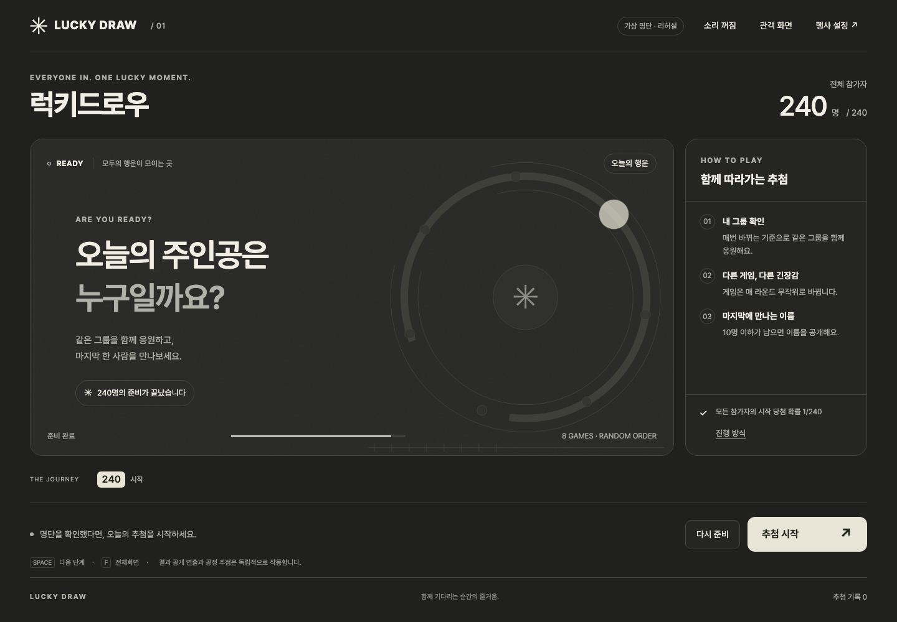
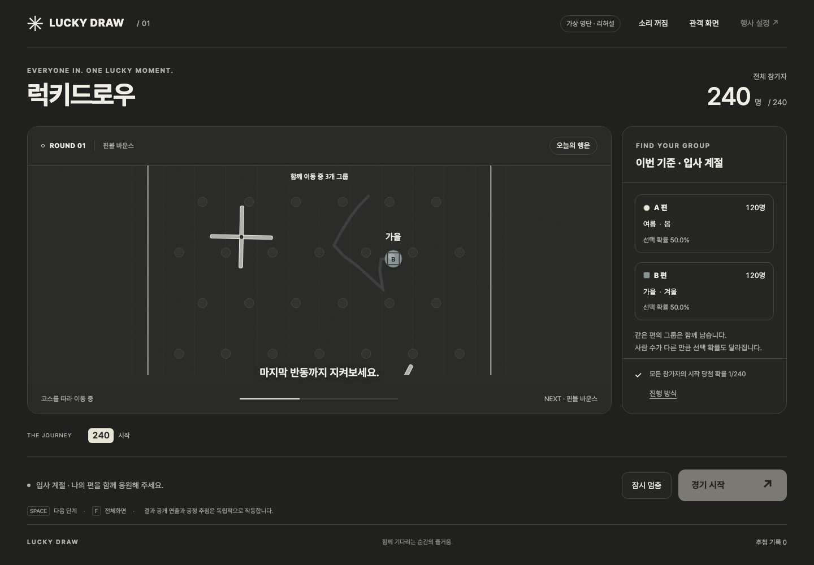

# 럭키드로우

함께 그룹을 응원하고, 마지막 한 사람을 만나는 행사 추첨 앱입니다. 특정 명절이나 회사에 묶이지 않으며 행사 제목·소개·경품·배경을 바꿔 사용할 수 있습니다.

**[럭키드로우 열기](https://01chungee10snu.github.io/chuseok-draw-show/)** · 개발 문서 v1.2.0



## 행사 시작하기

1. **행사 설정**에서 제목, 소개 문구, 경품과 화면 색상을 정합니다. 차콜·페이퍼·미드나이트 중 선택하거나 JPG/PNG/WebP 배경을 넣습니다.
2. **CSV 불러오기**로 참가자를 준비합니다. 처음에는 가상 명단 240명이 자동으로 열리므로 바로 리허설할 수 있습니다.
3. **추첨 대상 선택**에서 헤더(팀·지역·직위 등)를 고르고 고유값을 여러 개 체크합니다. 선택한 값 중 하나에 해당하는 참가자가 포함되며 값별 인원과 적용 예상 인원을 확인할 수 있습니다. 전체 선택·해제도 지원하고, 아무 값도 선택하지 않으면 0명으로 표시합니다. 같은 명단의 이전 당첨자 제외는 기본으로 켜져 있습니다.
4. 진행 방식은 기본 **자동 진행** 또는 **직접 설정**을 선택합니다. 직접 설정은 2~12라운드와 라운드별 시간·게임을 정합니다.
5. **추첨 시작**을 누르면 이번 기준과 A/B 편의 그룹이 공개됩니다. 모두 자기 편을 확인한 뒤 **경기 시작**을 누릅니다.
6. 다음 라운드마다 기준과 게임이 바뀝니다. 10명 이하가 남으면 이름을 공개하고, 필요한 경우 개인 결선을 진행합니다. 이름 공개 화면은 게임 라운드 수에 포함하지 않습니다.
7. **추첨 기록**에서 당첨자 CSV와 추첨 과정 JSON을 저장합니다. 다음 당첨자 뽑기는 새 추첨을 준비합니다.

**관객 화면**은 진행 정보를 줄이고 무대를 키웁니다. 빈 화면에 포커스가 있을 때 Space는 다음 단계, F는 전체화면입니다. 게임 중에는 **잠시 멈춤 / 이어서 진행**을 사용할 수 있습니다. 소리는 기본 꺼짐입니다.

## 명단 형식

최대 10MB / 20,000명입니다. UTF-8, CP949(EUC-KR), BOM이 있는 UTF-16 LE/BE를 읽으며 쉼표·탭·세미콜론과 Excel `sep=` 지시문을 인식합니다. 필수 컬럼은 이름 하나이며 `이름`, `성명`, `name`, `Full Name`, `Employee Name`, `참가자명` 등 보수적인 별칭을 공백·대소문자와 관계없이 찾습니다.

```csv
이름,참가자ID,팀,테이블,지역
김하늘,001,기획팀,1,서울
이바다,002,운영팀,2,부산
박봄,003,기획팀,1,대전
정별,004,운영팀,2,서울
```

- `참가자ID`, `사번`, `사원번호`, `Employee ID`, `id` 등은 선택 사항입니다. 주어진 ID는 중복될 수 없습니다. 앞자리 0은 보존됩니다.
- 이름이 같아도 별도 참가자로 허용하며 화면의 P001 같은 참가번호로 구별합니다. 한 사람이 중복 등록되지 않았는지는 운영자가 확인해야 합니다.
- 임의의 팀·지역·테이블 등 컬럼을 사용할 수 있습니다. 범주가 2~7개이면 그대로 사용하고, 8~100개이면 값당 평균 인원이 2명 이상일 때 사용합니다. 같은 값은 쪼개지 않고 A/B 한 편에 온전히 배치합니다. 수치형은 현재 분포에 따라 2~6개 구간으로 묶습니다.
- 누락값도 별도 그룹에 포함해 참가자를 빠뜨리지 않습니다. `#VALUE!`, `#N/A`, `#REF!` 등 표준 Excel 오류는 선택 컬럼에서 `(미입력)`으로 묶고 헤더별 개수를 경고합니다. 이름이나 ID의 오류 값은 가져오기를 거부합니다.
- 이름·사번·전체 이메일·전체 전화번호·연락처·생년월일 원문은 게임 기준에서 제외합니다. 한 글자 이메일 접두 문자와 전화번호 끝 한 자리는 실제 값이 글자/숫자 한 자일 때만 허용합니다.
- 기존 인사 명단도 지원합니다. 날짜가 유효하면 계절·요일 등의 파생 기준을 만듭니다. 사용하지 않을 기준은 설정에서 끌 수 있습니다.
- 이름만 있거나 더 나눌 기준이 없으면 참가번호로 10명을 균등 추첨한 뒤 이름을 공개합니다.
- 새 명단을 불러오면 현재 명단의 진행과 당첨 기록은 초기화됩니다. 잘못된 파일은 기존 명단을 유지하며 오류를 표시합니다.

실제 188행 CP949 검수 파일은 원본 7개 비식별 헤더가 모두 기준으로 인식됐고, 앱이 만든 `성씨 초성`까지 설정에 8개가 표시됐습니다. 해당 파일과 참가자 행은 저장소에 포함하지 않습니다.

## 라운드 설정

자동 진행은 현재 인원과 사용 가능한 기준에 맞춰 기존 흐름을 구성하며, 자연스럽게는 최소 18초, 여유롭게는 최소 24초로 실제 물리 코스를 원래 속도보다 빠르게 재생하지 않습니다.

직접 설정은 2~12라운드를 요청하고 각 라운드를 12~90초로 지정합니다. 기본값은 24초입니다. 실제 게임 수는 참가자가 `N`명일 때 `min(요청 라운드, N-1)`이며 1명 이하는 0라운드입니다. 지정 시간은 코스 재생 시간이고 골인 확인 약 1.4초가 더해집니다. 진행자가 다음 단계를 누르기까지의 대기는 예상 시간에 포함하지 않습니다. 짧은 시간은 같은 물리 경로를 더 빠르게 재생합니다.

10명 이하의 개인 결선은 선택한 게임을 사용합니다. 인원이 많은 균등 subset 추첨은 이름을 숨긴 채 명시적으로 라이트 그리드를 사용할 수 있습니다. 설정 변경은 확인 후 현재 세션을 초기화하며, 일시정지·재생 재시도는 이미 확정한 결과를 유지합니다.

## 게임과 화면

자동 그룹 라운드에는 10종 게임을 한 번씩 섞어 사용하는 shuffle bag을 적용합니다. 한 묶음 안에서 중복하지 않으며 묶음 경계에서도 같은 게임이 바로 이어지지 않습니다. 직접 설정에서는 13종 게임을 모두 선택할 수 있습니다.

| 구분 | 무대 |
|---|---|
| Box2D 그룹 코스 | 중력 계단, 회전 미로, 핀볼 바운스, 스윙 게이트, 라스트 게이트, 기어 캐스케이드, 브레이크어웨이 |
| 다른 움직임의 그룹 게임 | 오비트 랠리, 라이트 그리드, 리듬 터널 |
| 결선 Box2D 코스 | 스포트라이트 → 트윈 레이스 → 파이널 마블 |

13종 중 10종이 Box2D 코스입니다. 코스는 10ms 고정 스텝, 회전·왕복 셔틀·피스톤·공전·스윙 장애물, 카메라 추적, 결승 감속과 정체 복구를 사용합니다. 기어 캐스케이드는 맞물린 회전체를, 브레이크어웨이는 공이 닿은 발판이 사라지는 접촉 연출을 추가합니다. 이 동작은 참고 소스 commit `47230e3`의 맵 primitive와 접촉 수명주기에서 영감을 받아 앱의 공정 추첨·불변 재생 구조에 맞게 구현했습니다.

그룹은 A·B 대표 공 하나씩으로 달립니다. 먼저 골인한 공의 편 전체가 다음 라운드로 갑니다. 자동 결선은 먼저 골인한 4개 → 2개 → 1개의 개인 공이 진출합니다. 직접 설정은 남은 라운드 수에 맞춘 진출 인원을 경기 전에 표시하며, 골인한 공과 실제 진출 대상이 일치합니다. 물리 코스가 아닌 게임은 마지막 선택 표시로 진출 대상을 확인합니다.

탭을 숨기거나 일시정지한 시간은 연출 시간에서 제외합니다. 움직임 줄이기를 선택하면 2.4초의 정적인 공개 연출을 사용합니다. 코스 준비에 실패한 경우에도 정적 공개임을 화면에 알리고 확정 결과를 유지합니다.



## 공정성과 데이터

현재 참가자가 N명이고 A 편에 n명이 있으면 A 편 선택 확률은 n/N입니다. 선택된 편에서 이후 개인이 1/n의 확률로 당첨되므로 시작 시 개인의 최종 확률은 **1/N**입니다. 마지막 subset도 동일한 확률로 선택합니다. 난수는 Web Crypto의 rejection sampling과 Fisher–Yates shuffle을 사용합니다.

각 단계의 공정 추첨을 한 번 확정한 뒤, 그 대상을 실제 Box2D로 계산한 경로의 골인 순서에 **경기 시작 전에** 연결합니다. 경로 계산에는 이름이나 그룹 인원수를 넣지 않으며 모든 경로의 공은 같은 크기입니다. 화면에 보이기 시작한 뒤에는 공의 이름·경로 배정·추첨 결과가 바뀌지 않습니다. 따라서 골인한 공과 다음 라운드 대상이 일치하면서 개인별 확률도 유지됩니다. 화면 오류나 일시정지 때문에 다시 추첨하지 않습니다. 앱의 **진행 방식**에서도 이를 안내합니다.

CSV와 참가자·당첨 기록은 브라우저 메모리에서 처리하며 서버로 보내거나 자동 저장하지 않습니다. 새로고침하면 기록이 사라지므로 행사가 끝나기 전에 저장하세요. 행사 문구·색상·속도 설정만 이 브라우저에 저장합니다. 배경 이미지는 새로 열 때 다시 선택합니다. 감사 JSON에는 이름과 사번 원문을 담지 않지만 그룹 기준·선택 결과는 포함하므로 행사 기록으로 관리합니다.

## 개발과 배포

```sh
npm ci
npm test
npm run dev
npm run build
```

Node 24 이상을 권장합니다. GitHub Actions가 main push 후 테스트와 production build를 통과한 dist만 기존 GitHub Pages에 배포합니다. 저장소 URL은 기존 링크를 유지하고 앱 이름은 럭키드로우로 변경했습니다. 실제 참가자 CSV는 public이나 저장소에 추가하지 않습니다.

- 앱: `src/app.js`
- 범용 CSV·추첨 모델: `src/lucky-draw-model.js`
- 연출: `src/show-director.js`
- 골인 경로와 진출 대상 연결: `src/physics-race.js`
- 물리 런타임 / 맵: `src/physics-show-engine.js`, `src/physics-stage-maps.js`
- [설계 결정](docs/DECISIONS.md), [v1.0 검수](docs/QA_v1.0.md), [v1.0.1 재생 검수](docs/QA_v1.0.1.md), [v1.1 검수](docs/QA_v1.1.md), [v1.2 검수](docs/QA_v1.2.md), [변경 이력](CHANGELOG.md)
- Box2D와 참고 소스의 라이선스는 [THIRD_PARTY_NOTICES.md](THIRD_PARTY_NOTICES.md) 및 `licenses/`에 유지합니다.

기존 v0.7의 개발 기록과 이미지는 보존했습니다. v1.0 이전 내용은 당시 버전에 대한 기록입니다.
