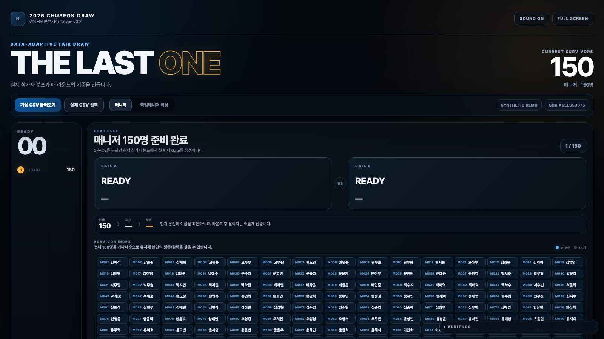

# CHUSEOK DRAW SHOW

현대제철 경영지원본부 추석 경품추첨을 위한 **정적 웹 프로토타입**입니다.

**Live prototype:** https://01chungee10snu.github.io/chuseok-draw-show/

## 핵심 원칙

- **실제 투입 CSV의 분포를 매 라운드 다시 읽어** 절단값/그룹을 동적으로 생성합니다.
- 두 Gate는 가능한 한 균형 있게 구성하되, 실제 Gate 선택은 **현재 Gate 인원수에 비례한 확률**로 수행합니다.
- 따라서 참가자 개인의 최종 당첨확률은 시작 시점 기준으로 동일한 `1/N`을 유지합니다.
- 실제 인사 CSV는 브라우저 메모리에서만 처리하며 저장소/서버로 전송하지 않습니다.
- 휴대폰 뒷자리 기반 규칙은 기본 비활성화합니다.

## 현재 프로토타입



- 가상 참가자 CSV 240명
- 매니저 / 책임매니저 이상 2개 추첨 Pool
- Dynamic Round Planner
- 조직/직무/생일/입사/이름 기반 동적 Gate
- Gate 인원 비례 Weighted Draw
- Final 8 → 4 → 2 → 1 연출
- Web Crypto 기반 난수
- 로컬 CSV 업로드
- 16:9 행사장 화면 중심 UI

## 실행

정적 파일이므로 저장소 루트에서 간단한 HTTP 서버만 띄우면 됩니다.

```bash
python3 -m http.server 4173
```

브라우저에서 `http://localhost:4173` 접속.

## 데이터 보안

실제 직원 CSV는 Git에 올리지 마십시오. `.gitignore`에서 실데이터 패턴과 `data/private/`, `data/real/`을 차단합니다.

프로토타입의 `data/demo_participants.csv`는 전부 가상 데이터입니다.

## 조작

- `SPACE`: 다음 라운드 / Final 진행
- `F`: 전체화면
- `R`: 현재 Pool 처음부터 재시작
- `AUDIT LOG`: CSV SHA-256, 각 라운드 Gate 인원/확률/생존자 수 확인

## 변경 이력

주요 설계 변경은 `CHANGELOG.md`, 의사결정은 `docs/DECISIONS.md`에 남깁니다.
