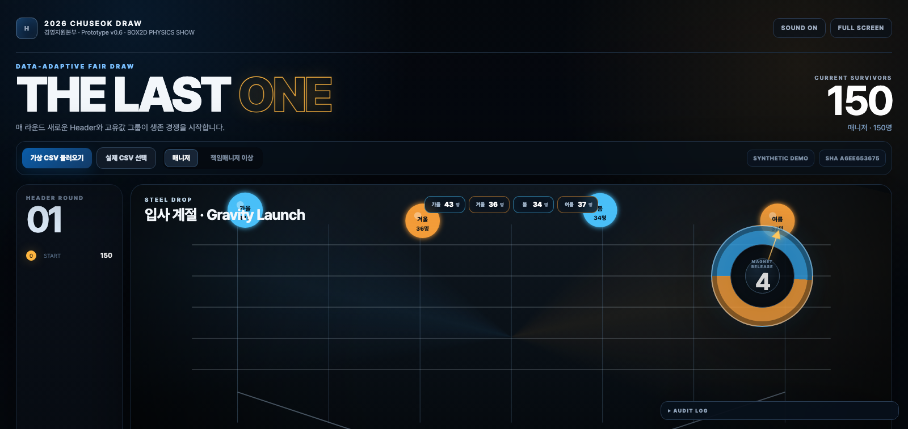
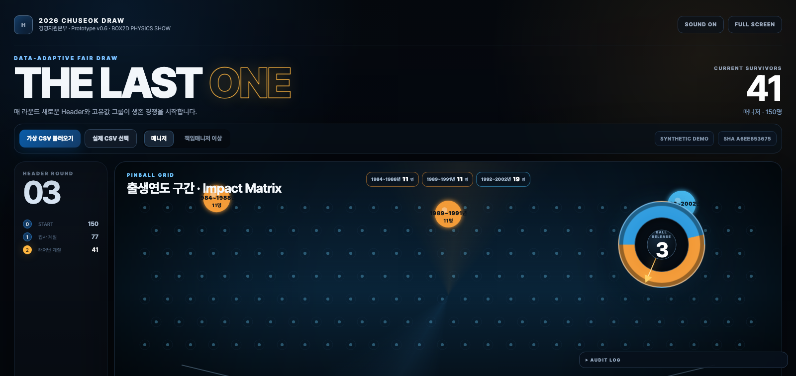
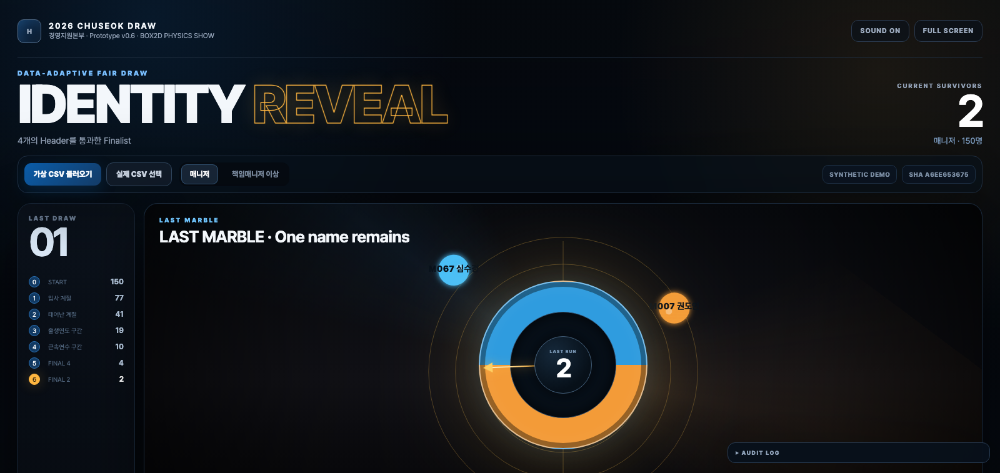

# CHUSEOK DRAW SHOW

현대제철 경영지원본부 추석 경품추첨을 위한 **정적 웹 프로토타입**입니다.

**Live prototype:** https://01chungee10snu.github.io/chuseok-draw-show/

## 핵심 원칙

- **실제 투입 CSV의 분포를 매 라운드 다시 읽어** 절단값/그룹을 동적으로 생성합니다.
- 두 Gate는 가능한 한 균형 있게 구성하되, 실제 Gate 선택은 **현재 Gate 인원수에 비례한 확률**로 수행합니다.
- 따라서 참가자 개인의 최종 당첨확률은 시작 시점 기준으로 동일한 `1/N`을 유지합니다.
- 실제 인사 CSV는 브라우저 메모리에서만 처리하며 저장소/서버로 전송하지 않습니다.
- 휴대폰 뒷자리 기반 규칙은 기본 비활성화합니다.

## 현재 프로토타입 · v0.6 Box2D Physics Show



초반에는 개인 이름을 사용하지 않습니다. 매 라운드 현재 생존자 데이터에서 **사용 가능한 Header를 다시 평가**하고, Header Roulette로 하나를 고른 뒤 해당 Header의 고유값을 2~7개 그룹으로 만들어 생존 경쟁을 진행합니다. 생존자가 5~10명에 도달하면 처음으로 Identity Reveal을 수행합니다.

v0.6부터 공정성 엔진과 Show Engine을 더 명확하게 분리했습니다. **Web Crypto + 인원비례 Group Gate 로직이 결과를 먼저 확정**하고, Box2D는 그 결과를 공개하는 물리 연출에만 사용됩니다.

| Stage | Renderer | 핵심 움직임 |
|---|---|---|
| Round 1 | **STEEL DROP · Box2D** | 중력 낙하 → Steel ramp/bumper 충돌 → Gate reveal |
| Round 2 | **MOON ORBIT · Canvas** | 보름달 중심 궤도 → 궤도 축소 → Orbit Lock |
| Round 3 | **PINBALL GRID · Box2D** | 실제 Peg 충돌/반발 → 지그재그 낙하 → Slot reveal |
| Round 4 | **FURNACE SPLIT · Canvas** | 컨베이어 이동 → 용광로 통과 → Steel Gate |
| Finalists→4 | **SPOTLIGHT CUT · Canvas** | 다중 Spotlight → 생존자 집중 |
| 4→2 | **TWIN ORBIT · Canvas** | 좌우 이중 궤도 → Final Two |
| 2→1 | **LAST MARBLE · Box2D** | 실제 물리 레이스 → Slow Motion → Winner reveal |





- 가상 참가자 CSV 240명
- 매니저 / 책임매니저 이상 2개 추첨 Pool
- Header Roulette: 매 라운드 다른 Header 자동 선정
- Categorical Header: 실제 고유값을 그대로 그룹으로 사용
- Numeric/Date Header: 현재 생존자 분포에 맞춘 동적 구간 생성
- 2~7개 Unique Value Group을 두 Survival Lane으로 균형 배치
- Lane 인원 비례 Weighted Draw로 개인 최종 확률 `1/N` 유지
- Group phase 동안 개인 이름 완전 비공개
- 자연스럽게 5~10명 도달 시 Identity Reveal
- Finalist 공개 후 균등 무작위 Final 4 → 2 → 1
- Box2D/WASM 물리 Stage와 Canvas Stage를 혼합 운영
- 물리엔진은 결과를 결정하지 않는 show-only layer
- Web Crypto 기반 난수
- 로컬 CSV 업로드
- Vite production build + GitHub Actions Pages 배포
- 16:9 행사장 화면 중심 UI

## 실행

```bash
npm ci
npm run dev
```

브라우저에서 `http://localhost:4173` 접속.

Production 확인:

```bash
npm test
npm run build
npm run preview
```

`npm run build`는 Box2D WASM, Third-Party Notice와 라이선스를 포함한 `dist/`를 생성합니다.

## 데이터 보안

실제 직원 CSV는 Git에 올리지 마십시오. `.gitignore`에서 실데이터 패턴과 `data/private/`, `data/real/`을 차단합니다.

프로토타입의 `public/data/demo_participants.csv`는 전부 가상 데이터입니다. 실제 인사 CSV는 `public/` 또는 Git 저장소에 두지 않습니다.

## 조작

- `SPACE`: 다음 라운드 / Final 진행
- `F`: 전체화면
- `R`: 현재 Pool 처음부터 재시작
- `AUDIT LOG`: CSV SHA-256, 각 라운드 Gate 인원/확률/생존자 수 확인

## 변경 이력

주요 설계 변경은 `CHANGELOG.md`, 의사결정은 `docs/DECISIONS.md`에 남깁니다.
