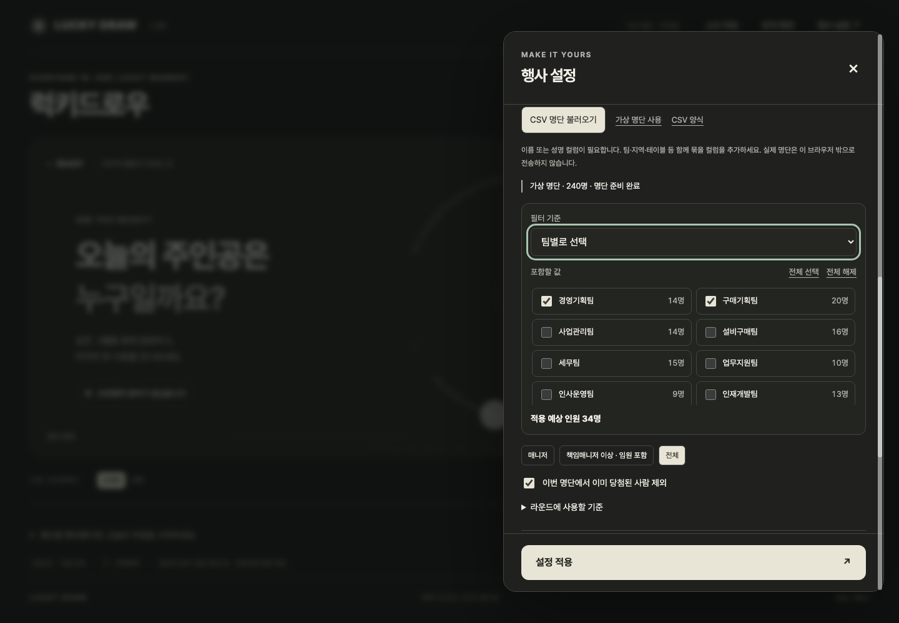
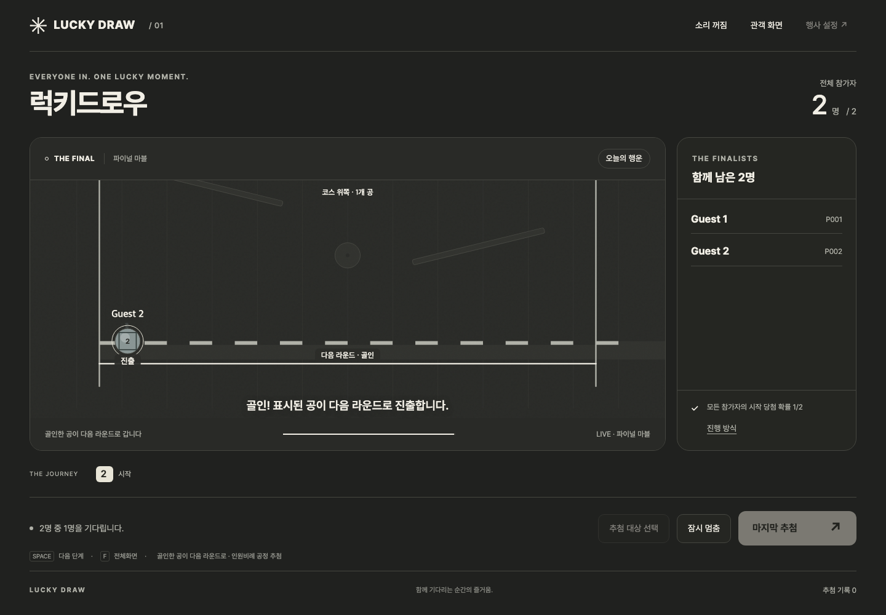
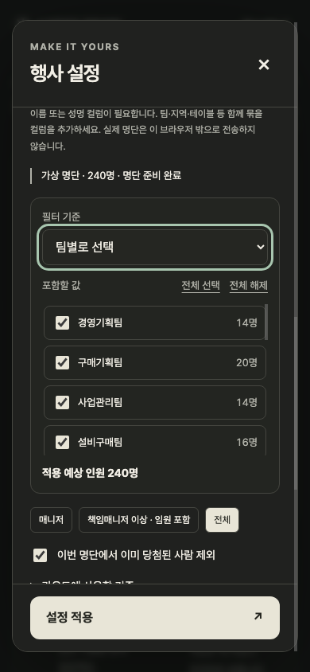

# 럭키드로우 v1.1 검수

검수일: 2026-09-18. 기준본은 v1.0.1 (`a2676b6`)이며 기존 로컬 레포를 제자리 수정했습니다. 이번 범위는 결승 떨림, 빠른 낙하, 골인과 진출의 불일치, 시작 대상의 고유값 필터입니다.

## 바뀐 동작

- 10ms 물리 스텝 사이의 위치·각도를 보간합니다. 카메라 중심은 좌우로 이동하지 않으며 확대는 최대 1.6배, 결승 감속은 0.58배까지입니다. 좁은 화면에서는 코스 폭이 잘리지 않도록 배율을 제한합니다.
- 초반 배속을 제거하고 중력과 감쇠를 조정했습니다. 기본 코스는 18초 이상, 여유 설정은 24초 이상 재생하며 긴 물리 경로를 원래 속도보다 빠르게 재생하지 않습니다.
- 정체 감시는 실제로 진행한 물리 시간을 사용합니다. 감속 중 반복되는 강한 속도 교체를 없애고 작은 충격으로 복구합니다. 벽 끝의 틈, 바깥쪽을 향한 마지막 경사로, 라스트 게이트의 경사로와 핀 중첩도 수정했습니다.
- A/B 대표 공은 각 편의 그룹 전체를 대표합니다. 먼저 골인한 대표 공의 편이 진출하며, 결선은 먼저 골인한 개인 공들이 진출합니다. 골인 장면을 약 0.6초 가리지 않고 보여준 뒤 결과판을 표시하며 총 약 1.4초 확인 시간을 둡니다.
- 대기 화면의 **추첨 대상 선택**에서 헤더 하나의 고유값을 여러 개 선택합니다. 값별 인원과 적용 예상 인원을 보여주며, 전체 해제는 0명입니다. 이전 당첨자 제외도 미리보기에 반영합니다.

## 공정 추첨과 물리 경로

인원비례 공정 추첨은 유지합니다. 진출 대상을 먼저 한 번 확정하고 익명·동일 크기 공들의 실제 Box2D 궤적을 계산한 뒤, 진출 대상을 골인 경로에 **화면 재생 전에 한 번 배정**합니다. 경기 중 이름이나 경로 배정을 바꾸지 않습니다. 물리 경로 계산에는 이름·그룹 인원수·추첨 결과가 들어가지 않습니다. 따라서 화면에서 골인한 공과 실제 진출 대상이 일치하며 개인별 당첨 확률은 유지됩니다. 이 방식은 앱의 진행 방식과 README에 공개했습니다.

재생 완료 시 실제 골인 ID 집합과 확정 진출 ID 집합이 같아야 다음 라운드를 적용합니다. 궤적 준비는 60초분의 시뮬레이션으로 제한합니다. 코스 준비 실패와 움직임 줄이기 모드는 정적 결과 공개라고 명시합니다. 비물리 게임은 마지막 선택 표시로 결과를 보여줍니다.

## 자동 검사와 코스 검수

Mac의 `npm test`: **41 PASS / 0 FAIL**. `npm run build`: **PASS**.

| 검사 | 결과 |
|---|---|
| 인원비례 구간, 개인별 확률, 균등 subset | 기존 공정성 검사 통과 |
| 8개 실제 WASM 코스 | 골인과 진출 ID 일치, 모든 재생 샘플의 식별자 고정 |
| 같은 경로 seed에서 인원수·확정 결과 변경 | 위치·각도·크기·코스 시간 동일 |
| 감속 중 새 물리 스텝이 없는 두 렌더 프레임 | 좌표가 연속으로 이동 |
| 600ms 렌더 간격 | 실제 골인 후 완료, 첫 골인 프레임에 결과판 없음 |
| 일시정지·숨김·로딩·긴 프레임 정지 | 대기 시간을 연출에 더하지 않고 정상 재개 |
| 고유값 다중 선택 | OR 결합, 미입력 범주, 빈 선택 검증 |

별도로 seed `0, 1, 18, 71, 987654321`을 사용해 8개 코스 × 5회, **40/40**을 확인했습니다. 그룹은 2개 공 중 1개, 스포트라이트는 10개 중 4개, 트윈은 4개 중 2개, 파이널은 2개 중 1개를 진출시켰습니다. 초기 라스트 게이트 2개 조건의 정체를 재현해 핀 위치를 수정한 뒤 해당 5개 조건을 다시 통과했습니다.

| 코스 | 통과 | 가장 긴 재생 시간 |
|---|---:|---:|
| 중력 계단 | 5/5 | 24.73초 |
| 회전 미로 | 5/5 | 26.32초 |
| 핀볼 바운스 | 5/5 | 18.56초 |
| 스윙 게이트 | 5/5 | 23.99초 |
| 라스트 게이트 | 5/5 | 18.00초 |
| 스포트라이트 | 5/5 | 18.00초 |
| 트윈 레이스 | 5/5 | 18.00초 |
| 파이널 마블 | 5/5 | 18.00초 |

시간은 골인까지이며 결과 확인 시간은 별도입니다. [원시 코스 결과](qa-v1.1/course-sweep.json). 모든 seed의 완료 시간을 보장하는 검사는 아닙니다.

## 실제 Mac Chrome 화면

합성 명단만 사용했습니다. 데스크톱 1440×1000, 모바일 뷰포트 390×844에서 확인했습니다.

| 흐름 | 실제 확인 |
|---|---|
| 팀 고유값 두 개 선택 | 경영기획팀 14명 + 구매기획팀 20명 = 34명 적용 |
| 전체 해제 | 0명, 추첨 시작 비활성 |
| 기존 대상 선택 | 매니저 150명 / 책임매니저 이상 90명 / 전체 240명 |
| 중력 계단 | 240 → 125명, 골인·진출 모두 `r1lane0` |
| 트윈 레이스 | 4 → 2명, 골인·진출 모두 `P001`, `P002` |
| 파이널 마블, 최종 코드 | 2 → 1명, 골인·당첨 모두 `P002` |
| 중간 일시정지 600ms | 공 위치·카메라·진행 시간 유지, 재개 후 정상 골인 |
| 모바일 대상 선택 | 고유값 16개, 예상 240명, 가로 넘침 없음 |
| JavaScript 미처리 예외 | 0개 |

마지막 1.5초 구간에서 그룹은 17프레임, 트윈은 23프레임, 최종 파이널은 23프레임을 기록했습니다. 시간이 진행된 프레임 사이의 공 좌표 정지는 각각 0회, 카메라 좌우 변화량은 모두 0이었습니다. 파이널의 실제 첫 골인 장면이 결과판에 가려지지 않는 것도 캡처로 확인했습니다.

검수 도중 이전 파이널 실행은 정상 골인했지만 샘플 14개가 검수 스크립트의 임의 기준 15개보다 작아 스크립트가 실패했습니다. 그 실행의 13회 좌표 비교는 모두 이동했고 골인·진출도 일치했습니다. 유휴 브라우저의 기본 프레임 전달도 약 14~16fps로 관측됐습니다. 최종 검사는 샘플 수 자체 대신 실제 좌표 이동을 판정하며 23개 샘플을 확보했습니다. 따라서 이 결과는 계단식 좌표 정지와 좌우 카메라 흔들림의 회귀 검증이며 60fps 성능을 보장하지 않습니다. 실제 행사 프로젝터와 Safari·Firefox 검사는 수행하지 않았습니다.

[브라우저 원시 기록](qa-v1.1/browser-results.json). 그룹·트윈 캡처는 마지막 골인 표시 시간을 조정하기 전이며, `final-visible-*`와 `winner.png`가 최종 표시 코드의 캡처입니다.

## 변경 파일과 보존

원본 기준은 Git의 `a2676b6`에 보존됩니다. 기존 v0.7 백업은 `/Users/01chungee10/Github/chuseok-draw-show-v07-backup-20260917.tgz`이며 유지했습니다. 별도 제품 복사본을 만들지 않고 아래 레포를 제자리 수정했습니다.

| 전체 경로 | 역할·처리 |
|---|---|
| `/Users/01chungee10/Github/chuseok-draw-show/src/app.js` | output/current · 필터·진출 대상·물리 경로 연결 |
| `/Users/01chungee10/Github/chuseok-draw-show/src/lucky-draw-model.js` | output/current · 고유값 다중 필터 |
| `/Users/01chungee10/Github/chuseok-draw-show/src/physics-show-engine.js` | output/current · 좌표 보간·감속·정체 복구 |
| `/Users/01chungee10/Github/chuseok-draw-show/src/physics-stage-maps.js` | output/current · 자연 속도·코스 병목 수정 |
| `/Users/01chungee10/Github/chuseok-draw-show/src/physics-race.js` | output/current · NEW, 실제 골인 경로 기록과 고정 배정 |
| `/Users/01chungee10/Github/chuseok-draw-show/src/show-director.js` | output/current · 재생·골인 확인·모바일 코스 폭 |
| `/Users/01chungee10/Github/chuseok-draw-show/index.html` | output/current · 대상 선택·진행 방식·속도 설정 |
| `/Users/01chungee10/Github/chuseok-draw-show/assets/styles.css` | output/current · 대상 선택 화면 |
| `/Users/01chungee10/Github/chuseok-draw-show/package.json` | output/current · 버전 1.1.0 |
| `/Users/01chungee10/Github/chuseok-draw-show/package-lock.json` | output/current · 루트 버전 동기화 |
| `/Users/01chungee10/Github/chuseok-draw-show/tests/lucky-draw-model.test.mjs` | verification/current · OR·빈 선택·미입력 검사 |
| `/Users/01chungee10/Github/chuseok-draw-show/tests/physics-show-engine.test.mjs` | verification/current · 자연 속도 회귀 |
| `/Users/01chungee10/Github/chuseok-draw-show/tests/physics-race.test.mjs` | verification/current · NEW, 실제 골인·배정·보간 검사 |
| `/Users/01chungee10/Github/chuseok-draw-show/tests/show-director.test.mjs` | verification/current · 재생·골인 표시 회귀 |
| `/Users/01chungee10/Github/chuseok-draw-show/README.md` | documentation/current · 사용법과 공정성 설명 |
| `/Users/01chungee10/Github/chuseok-draw-show/CHANGELOG.md` | documentation/current · 변경 이력 |
| `/Users/01chungee10/Github/chuseok-draw-show/docs/DECISIONS.md` | documentation/current · D020–D022 추가 |
| `/Users/01chungee10/Github/chuseok-draw-show/docs/QA_v1.1.md` | verification/current · NEW, 검수와 파일 인계 |
| `/Users/01chungee10/Github/chuseok-draw-show/docs/qa-v1.1/browser-results.json` | verification/current · NEW, 브라우저 수치 |
| `/Users/01chungee10/Github/chuseok-draw-show/docs/qa-v1.1/course-sweep.json` | verification/current · NEW, 40개 코스 결과 |
| `/Users/01chungee10/Github/chuseok-draw-show/docs/qa-v1.1/filters.png` | verification/current · NEW, 데스크톱 필터 |
| `/Users/01chungee10/Github/chuseok-draw-show/docs/qa-v1.1/mobile-filters.png` | verification/current · NEW, 모바일 필터 |
| `/Users/01chungee10/Github/chuseok-draw-show/docs/qa-v1.1/group-approach.png` | verification/current · NEW, 그룹 결승 접근 |
| `/Users/01chungee10/Github/chuseok-draw-show/docs/qa-v1.1/group-qualified.png` | verification/current · NEW, 그룹 확인판 |
| `/Users/01chungee10/Github/chuseok-draw-show/docs/qa-v1.1/twin-approach.png` | verification/current · NEW, 4명 결승 접근 |
| `/Users/01chungee10/Github/chuseok-draw-show/docs/qa-v1.1/twin-qualified.png` | verification/current · NEW, 2명 진출 확인판 |
| `/Users/01chungee10/Github/chuseok-draw-show/docs/qa-v1.1/final-approach.png` | verification/current · NEW, 이전 파이널 접근 |
| `/Users/01chungee10/Github/chuseok-draw-show/docs/qa-v1.1/final-qualified.png` | verification/current · NEW, 이전 파이널 확인판 |
| `/Users/01chungee10/Github/chuseok-draw-show/docs/qa-v1.1/final-visible-approach.png` | verification/current · NEW, 최종 파이널 접근 |
| `/Users/01chungee10/Github/chuseok-draw-show/docs/qa-v1.1/final-visible-qualified.png` | verification/current · NEW, 최종 실제 골인 |
| `/Users/01chungee10/Github/chuseok-draw-show/docs/qa-v1.1/winner.png` | verification/current · NEW, 최종 당첨자 |

폴더 구조:

- `/Users/01chungee10/Github/chuseok-draw-show/` — 현재 제품, Git 원본 보존
  - `src/`, `assets/`, `index.html`, `package*.json` — 앱 구현
  - `tests/` — 자동 검증
  - `docs/`
    - `QA_v1.1.md`, `DECISIONS.md` — 검수·결정
    - `qa-v1.1/` — 이번 검수의 JSON 2개와 PNG 11개
  - `README.md`, `CHANGELOG.md` — 사용법·변경 이력
