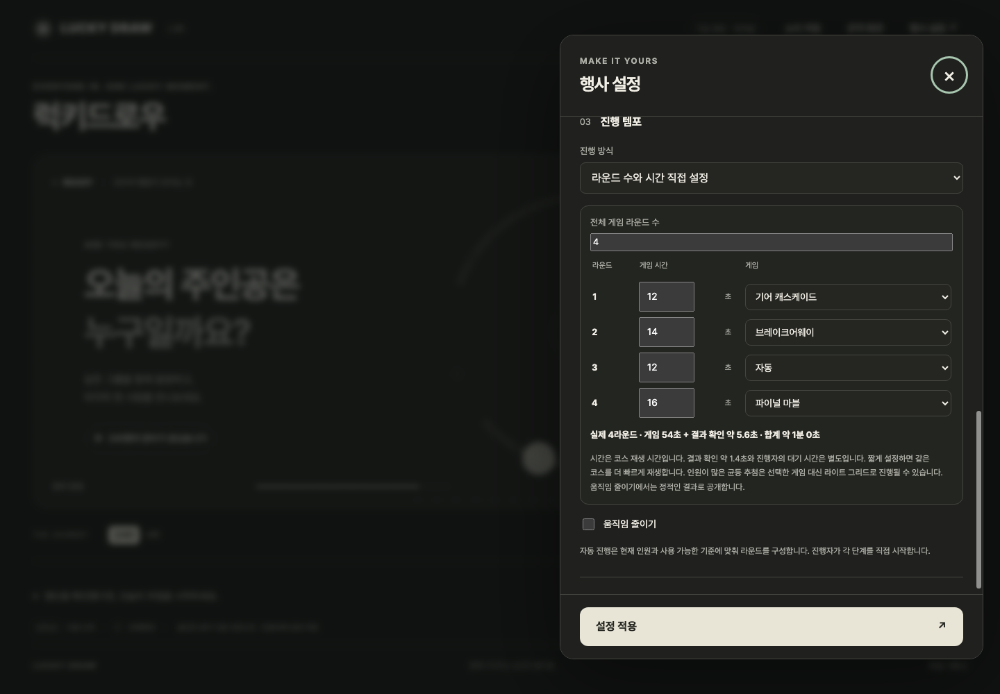
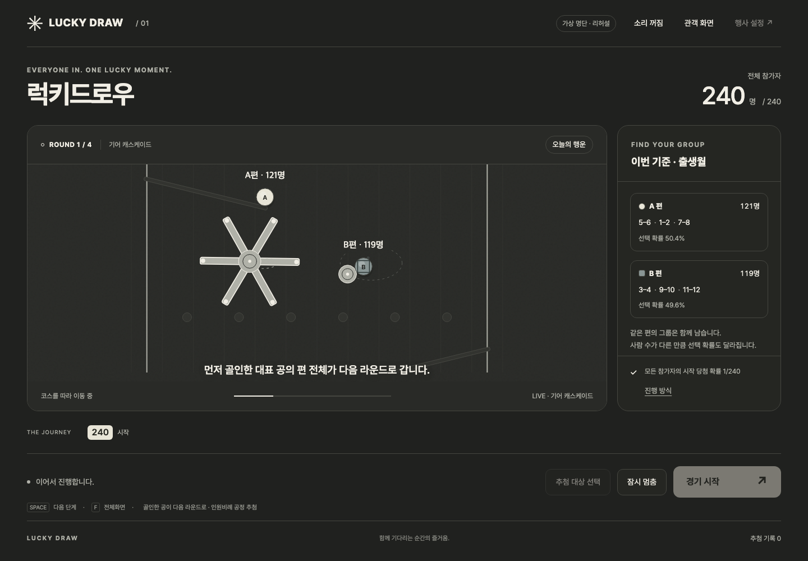
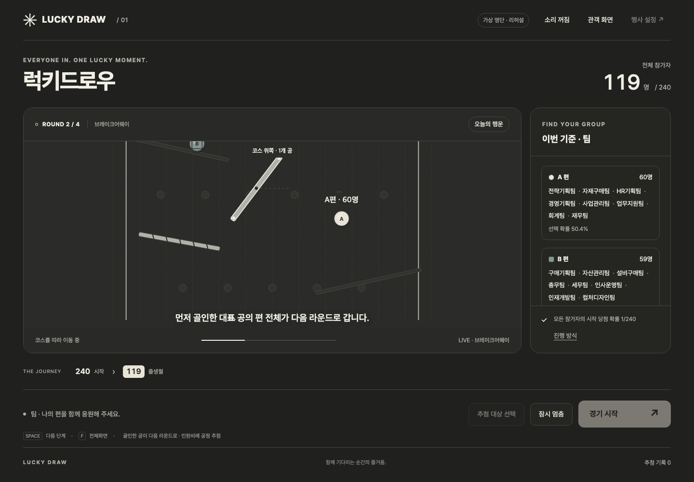

# 럭키드로우 v1.2 검수

검수일: 2026-09-18. 기준본은 v1.1.0 (`163735f`)입니다. 기존 로컬 레포를 제자리 개선했습니다.

## 실제 사용 동작

- **행사 설정 → 진행 템포 → 라운드 수와 시간 직접 설정**에서 2~12라운드, 각 12~90초와 게임을 선택합니다. 시간 기본값은 24초입니다. 자동 진행도 유지합니다.
- 실제 게임 수는 참가자가 N명이면 `min(요청 수, N-1)`이며 1명 이하는 0입니다. 매 게임이 인원을 줄이고 마지막 게임은 한 명을 남깁니다. 이름 공개 화면은 게임으로 세지 않습니다.
- 지정 시간은 코스 재생 시간입니다. 결과 확인 약 1.4초와 진행자의 대기 시간은 별도이며 예상 합계에서 대기 시간을 제외합니다. 짧게 지정하면 동일한 물리 경로를 빠르게 재생합니다. 자동 모드는 최소 18초/여유 24초로 원래 물리 경로보다 빨리 재생하지 않습니다.
- 전체 13종 중 10종이 Box2D 코스입니다. 직접 설정에서는 모두 고를 수 있습니다. 자동 그룹 게임은 7종 물리 코스와 3종 Canvas 게임을 섞어 한 묶음 내 중복을 피합니다.
- 10명 초과의 균등 subset 추첨은 라이트 그리드로 명시합니다. 개인 결선은 남은 라운드 수에 맞춘 진출 인원과 선택한 게임을 사용합니다.
- 제목·소개·경품·매트 테마·사용자 배경, 시작 대상의 헤더 고유값 다중 선택을 유지합니다. 참가자와 당첨 기록은 자동 영구 저장하지 않고 행사 설정만 복원합니다.
- 일시정지와 재시도는 확정 결과를 유지합니다. 일정/대상 변경은 확인 후 현재 추첨을 초기화합니다. 움직임 줄이기는 지정 코스 대신 짧은 정적 공개임을 알립니다.

## CSV와 실제 입력 확인

UTF-8, CP949(EUC-KR), BOM UTF-16 LE/BE와 쉼표·탭·세미콜론·Excel `sep=`를 지원합니다. 필수 이름 헤더의 별칭과 임의 그룹 헤더를 인식하며 ID는 선택 사항입니다. 따옴표·행 열 수·중복 ID 오류는 거부하고 이전 명단을 유지합니다.

사용자 제공 파일은 **CP949, 188명, 9개 컬럼**입니다. 실제 Chrome 파일 입력에 같은 바이트를 넣었습니다.

| 항목 | 실제 결과 |
|---|---|
| 비식별 원본 헤더 | 7개 모두 사용 가능 |
| 설정에 표시한 기준 | 기존 파생 성씨 초성을 더해 8개 |
| 소속 고유값 | 27개, 같은 소속을 쪼개지 않고 94/94 배치 |
| 매니저 / 임원·책임 대상 | 68명 / 120명 |
| 휴대전화 끝 한 자리 오류 | `#VALUE!` 1개를 미입력으로 유지하고 헤더·건수 경고 |
| 미입력만 필터 | 1명 정상 적용 |
| 전체 대상으로 복원 | 188명 |
| 실제 그룹 경기 | 기어 캐스케이드, 188 → 94명, 골인·진출 일치 |

이름·ID의 Excel 오류는 가져오기를 거부합니다. 선택 컬럼의 표준 오류는 행을 버리지 않고 미입력 그룹으로 처리합니다. 전체 이메일·전화번호는 게임 기준에서 제외하고, 한 글자 메일 접두 문자와 전화번호 끝 한 자리처럼 명시적인 파생값만 검증 후 허용합니다.

원본과 검수용 복사본 SHA-256: `d484c59083263fc2ec8ff98605101123bffd2d97689196e0e812ed4ef827e800`. 실제 CSV와 참가자 행은 저장소에 포함하지 않습니다.

## 물리와 공정성

왕복 셔틀·피스톤·공전·스윙을 실제 Box2D kinematic body의 속도로 진행합니다. 10ms 고정 스텝의 같은 물리 시간을 사용하므로 공과 장애물이 함께 감속합니다. 경기 중 위치를 순간 이동시키지 않습니다.

**기어 캐스케이드**는 이동하는 회전체와 공전 범퍼, **브레이크어웨이**는 공이 닿은 발판의 실제 비활성화를 추가합니다. 재생에도 이동 궤적과 발판이 사라지는 시점이 기록됩니다. 기존 보간, 결승 감속 0.58배·확대 1.6배, 좌우 고정 카메라와 정체 복구를 유지합니다.

공정 추첨으로 진출 대상을 한 번 확정하고, 익명·동일 크기 공의 실제 골인 경로에 **화면 재생 전** 배정합니다. 경기 중 이름·경로 배정은 바뀌지 않습니다. 물리 골인 ID와 확정 진출 ID가 일치해야 다음 라운드를 적용합니다. 지정 시간은 재생 속도에만 영향을 줍니다. 이 구조는 앱 진행 방식과 README에 공개합니다.

참고는 [lazygyu/roulette의 maps.ts](https://github.com/lazygyu/roulette/blob/47230e3/src/data/maps.ts)와 [physics-box2d.ts](https://github.com/lazygyu/roulette/blob/47230e3/src/physics-box2d.ts)의 맵 primitive 및 접촉 수명주기입니다. 새 경로·맵·재생은 이 앱 구조에 맞게 구성했으며 원본을 통째로 가져오지 않았습니다. MIT 고지와 기존 라이선스를 보존했습니다.

## 자동 검증

**npm test: 58 PASS / 0 FAIL. npm run build: PASS.**

검사에는 실제 바이트 디코딩, 다양한 CSV 구분자·헤더·오류 처리, 인원별 고정 라운드 종료, 균등 subset과 인원비례 추첨, 장애물의 연속 좌표, 이동 장애물의 실제 충돌, 접촉 발판 비활성화·재생, 12초/30초 재생의 동일 경로·동일 진출자, 고정 식별자, 감속 보간·일시정지 회귀가 포함됩니다.

물리 코스 10개 × seed 5개(`0, 1, 18, 71, 987654321`) = **50/50 PASS**. 모든 샘플에서 식별자가 고정됐고 실제 골인 집합이 확정 진출 집합과 일치했습니다. 자동 모드 골인까지 18~31.504초였으며 결과 확인은 별도입니다. 모든 가능한 seed의 완료 시간을 보장하는 검사는 아닙니다.

[원시 코스 결과](qa-v1.2/course-sweep.json). 재현:

```sh
node scripts/qa-physics-courses.mjs /tmp/lucky-draw-course-sweep.json
```

## 실제 Mac Chrome 검수

데스크톱 1440×1000, 모바일 390×844. 아래 4라운드는 공개 합성 데모 명단을 사용했습니다.

| 게임 | 인원 | 지정 재생 | 확인 포함 실제 시간 | 확인 |
|---|---:|---:|---:|---|
| 기어 캐스케이드 | 240 → 119 | 12초 | 13.53초 | 골인·진출 일치, 600ms 일시정지 후 정상 재개 |
| 브레이크어웨이 | 119 → 60 | 14초 | 15.48초 | 골인·진출 일치, 접촉 발판 4개 소멸 |
| 라이트 그리드 | 60 → 8 | 12초 | 13.48초 | 익명 균등 추첨, 다음 단계에서 이름 공개 |
| 파이널 마블 | 8 → 1 | 16초 | 17.60초 | 골인·당첨 일치, 총 4게임·당첨 1명 |

물리 게임 중 공의 식별자가 유지됐고 장애물 위치가 이동했습니다. 새로고침 후 4라운드·첫 게임 12초·기어 코스 설정이 복원됐습니다. 모바일은 12행·게임 선택 14개(자동+13종), 가로 넘침 없음(390/390px), 숫자를 1→12로 연속 입력하는 동작을 확인했습니다. 모바일 재검수의 미처리 JavaScript 예외는 0개였습니다.

초기 검수 스크립트가 기존 파생 헤더를 빼고 7개로 예상했으나 실제는 8개여서 기준을 수정했습니다. 전체 경기 검증 뒤 모바일 검수는 입력 전용 핸들러에 change 이벤트를 보내 실패했습니다. 이 과정에서 10~12 입력 중 첫 숫자를 너무 일찍 보정하는 실제 문제를 발견해 수정하고 입력·확정 이벤트를 모두 검증했습니다. 완료한 경기 수치는 기존 출력에서 그대로 보존하고 모바일 단계만 재개했습니다.

[브라우저 원시 기록](qa-v1.2/browser-results.json). 화면 캡처는 합성 명단입니다. 이번 검수는 동작·시간·골인 일치를 확인하며 60fps 성능 보장은 아닙니다. 실제 행사 프로젝터, Safari·Firefox는 검수하지 않았습니다.





추가 화면: [모바일 설정](qa-v1.2/mobile-settings.png), [파이널 진행](qa-v1.2/last-marble.png), [실제 골인](qa-v1.2/finish.png).

## 파일 인계와 보존

- 현재 제품 원본: `/Users/01chungee10/Github/chuseok-draw-show` — Git 연결된 로컬 레포, 제자리 수정.
- 검수 입력: `/workspace/scratch/0625f395b257/upload/경영지원본부행사 - fake.csv` — source/input, 변경 없음.
- 같은 바이트의 Mac 검수 복사본: `/private/tmp/lucky-v12-input.csv` — verification/temporary, 제품에 포함하지 않음.
- 기존 v0.7 백업: `/Users/01chungee10/Github/chuseok-draw-show-v07-backup-20260917.tgz` — source/backup, 유지.
- 동기화 작업 경로: `/workspace/scratch/0625f395b257/lucky-draw` — 같은 Git 프로젝트의 작업 사본.

| 전체 로컬 경로 | 역할·처리 |
|---|---|
| `/Users/01chungee10/Github/chuseok-draw-show/src/app.js` | output/current · CSV 경고·일정·진출 연결·입력 보정 |
| `/Users/01chungee10/Github/chuseok-draw-show/src/lucky-draw-model.js` | output/current · 바이트 디코딩·헤더·그룹·필터 |
| `/Users/01chungee10/Github/chuseok-draw-show/src/round-schedule.js` | output/current · NEW, 일정과 진출 인원 계산 |
| `/Users/01chungee10/Github/chuseok-draw-show/src/physics-motion.js` | output/current · NEW, 연속 장애물 궤적 |
| `/Users/01chungee10/Github/chuseok-draw-show/src/physics-show-engine.js` | output/current · 실제 이동·접촉 발판 |
| `/Users/01chungee10/Github/chuseok-draw-show/src/physics-stage-maps.js` | output/current · 10개 동적 물리 맵 |
| `/Users/01chungee10/Github/chuseok-draw-show/src/physics-race.js` | output/current · 이동·발판 기록과 지정 시간 재생 |
| `/Users/01chungee10/Github/chuseok-draw-show/src/show-director.js` | output/current · 13개 게임·동적 장애물 표시 |
| `/Users/01chungee10/Github/chuseok-draw-show/index.html` | output/current · CSV 안내·라운드 설정 |
| `/Users/01chungee10/Github/chuseok-draw-show/assets/styles.css` | output/current · 데스크톱·모바일 일정 화면 |
| `/Users/01chungee10/Github/chuseok-draw-show/package.json` | output/current · 1.2.0 |
| `/Users/01chungee10/Github/chuseok-draw-show/package-lock.json` | output/current · 버전 동기화 |
| `/Users/01chungee10/Github/chuseok-draw-show/THIRD_PARTY_NOTICES.md` | documentation/current · 원본 참고·MIT 고지 |
| `/Users/01chungee10/Github/chuseok-draw-show/README.md` | documentation/current · 사용법·공정성·시간 의미 |
| `/Users/01chungee10/Github/chuseok-draw-show/CHANGELOG.md` | documentation/current · v1.2 변경 이력 |
| `/Users/01chungee10/Github/chuseok-draw-show/docs/DECISIONS.md` | documentation/current · D023–D025 |
| `/Users/01chungee10/Github/chuseok-draw-show/docs/QA_v1.2.md` | verification/current · NEW, 검수·파일 인계 |
| `/Users/01chungee10/Github/chuseok-draw-show/tests/csv-import.test.mjs` | verification/current · NEW, 동작 회귀 |
| `/Users/01chungee10/Github/chuseok-draw-show/tests/round-schedule.test.mjs` | verification/current · NEW, 동작 회귀 |
| `/Users/01chungee10/Github/chuseok-draw-show/tests/physics-motion.test.mjs` | verification/current · NEW, 동작 회귀 |
| `/Users/01chungee10/Github/chuseok-draw-show/tests/lucky-draw-model.test.mjs` | verification/current · 기존 계약 갱신 |
| `/Users/01chungee10/Github/chuseok-draw-show/tests/physics-race.test.mjs` | verification/current · 기존 계약 갱신 |
| `/Users/01chungee10/Github/chuseok-draw-show/tests/physics-show-engine.test.mjs` | verification/current · 기존 계약 갱신 |
| `/Users/01chungee10/Github/chuseok-draw-show/scripts/qa-physics-courses.mjs` | verification/current · NEW, 실제 WASM 50조건 재현 |
| `/Users/01chungee10/Github/chuseok-draw-show/docs/qa-v1.2/browser-results.json` | verification/current · NEW, 실제 브라우저 수치 |
| `/Users/01chungee10/Github/chuseok-draw-show/docs/qa-v1.2/course-sweep.json` | verification/current · NEW, 50조건 결과 |
| `/Users/01chungee10/Github/chuseok-draw-show/docs/qa-v1.2/round-settings.png` | verification/current · NEW, 합성 명단 화면 |
| `/Users/01chungee10/Github/chuseok-draw-show/docs/qa-v1.2/mobile-settings.png` | verification/current · NEW, 합성 명단 화면 |
| `/Users/01chungee10/Github/chuseok-draw-show/docs/qa-v1.2/gear-cascade.png` | verification/current · NEW, 합성 명단 화면 |
| `/Users/01chungee10/Github/chuseok-draw-show/docs/qa-v1.2/breakaway-steps.png` | verification/current · NEW, 합성 명단 화면 |
| `/Users/01chungee10/Github/chuseok-draw-show/docs/qa-v1.2/last-marble.png` | verification/current · NEW, 합성 명단 화면 |
| `/Users/01chungee10/Github/chuseok-draw-show/docs/qa-v1.2/finish.png` | verification/current · NEW, 합성 명단 화면 |

폴더 구조:

- `/Users/01chungee10/Github/chuseok-draw-show/` — 현재 제품
  - `src/`, `assets/`, `index.html`, `package*.json` — 앱·물리·일정
  - `tests/`, `scripts/qa-physics-courses.mjs` — 자동 검증
  - `docs/QA_v1.2.md`, `docs/DECISIONS.md` — 검수·설계 결정
  - `docs/qa-v1.2/` — JSON 2개·PNG 6개
  - `README.md`, `CHANGELOG.md`, `THIRD_PARTY_NOTICES.md` — 사용법·이력·출처

